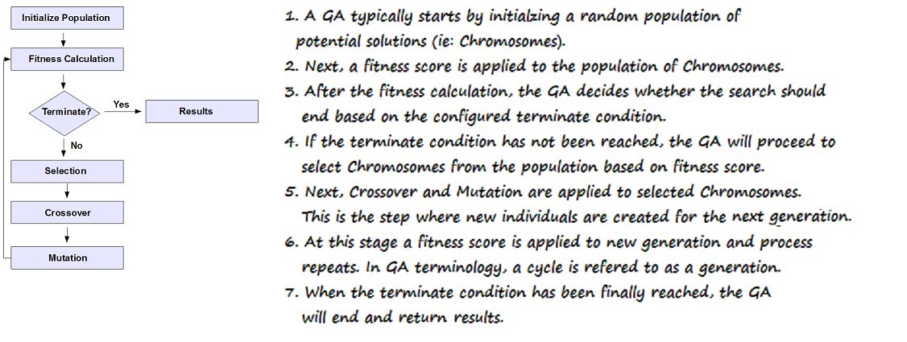
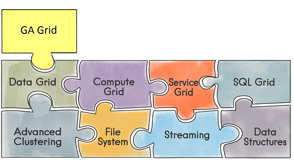
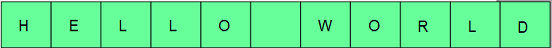

* <a href="#summary">Summary</a>  <br/>
* <a href="#howtoinstall">How to Install</a>  <br/>
* <a href="#usageguide">Usage Guide</a>  <br/>
    - <a href="#startgagrid">Start GA Grid</a>  <br/>
* <a href="#examples">Examples</a> 
* <a href="#glossary">Glossary</a>  <br/>


### <a name="summary">Summary</a> <br/>

**GA Grid (Beta)** is an in memory **Genetic Algorithm (GA)** component for [Apache Ignite](https://ignite.apache.org/). A **GA** is a method of solving optimization problems by simulating the process of biological evolution.
**GA Grid** provides a distributive **GA**  library built on top of a mature and scalable [Apache Ignite](https://ignite.apache.org/) platform. **GAs** are excellent for searching through large and complex data sets for an optimal solution.  Real world applications of **GAs** include: automotive design, computer gaming, robotics, investments, traffic/shipment routing and more.


The following diagram depicts the steps performed by **GA Grid**.


 > NOTE: If you are unfamiliar with **GA** terminology please refer to the <a href="#glossary">Glossary</a> .


**Figure 1: Genetic Algorithm Process**

<br/>



<br/>


**GA Grid** is a viable solution for developing scalable **GAs** as it leverages **Apache Ignite's** core components :

  - **Advanced Clustering**
  - **Compute Grid**
  - **Data Grid**
  - **SQL Grid**

The following diagram depicts how **GA Grid** component fits into **Apache Ignite**.

**Figure 2: GA Grid component in Apache Ignite.**



<br/>

The following diagram depicts **GA Grid's** architecture:
<br/>
<br/>

**Figure 3: GA Grid Architecture**


The diagram above depicts the major elements of **GA Grid**.<br/>
 **(F)itness Calculation**, **(C)rossover**, and **(M)utation** operations are modeled as a ComputeTask for distributive behavior.   The ComputeTask is split into multiple ComputeJobs, (ie: **F~n~,C~n~,M~n~**) assigned to respective nodes, and executed in parallel.

All of these ComputeTasks leverage  <a href="https://apacheignite.readme.io/docs/affinity-collocation#collocating-compute-with-data" target="_blank">Apache Ignite's Affinity Colocation</a> to route ComputeJobs to respective nodes where Chromosomes are stored in cache.


### <a name="howtoinstall">How to Install</a> <br/>


>NOTE: **GAGrid_HOME**  refers to GA Grid installation folder.

 **Prerequisites:** <br/>

| Name | Value |
| ------ | ------|
| JDK | Oracle JDK 7 and above|
| Ignite | 1.9.x and above|


**Steps:**

Here is the quick summary on installation of **GA Grid** on Apache Ignite:

 - Copy the ***GAGrid_HOME\dist\gagrid-beta.jar*** to **IGNITE_HOME\libs**
 - Copy the ***GAGrid_HOME\dist\gagrid-beta-tests.jar*** to **IGNITE_HOME\libs**
   > NOTE: ***gagrid-beta-tests.jar*** is required to run the examples


### <a name="usageguide">Usage Guide</a> <br/>

In order to begin using **GA Grid**, you will follow these steps:

 1. <a href="#step1">Create a GAConfiguration object</a><br/>
 2. <a href="#step2">Define the Gene and Chromosome </a><br/>
 4. <a href="#step3">Implement a fitness function</a><br/>
 5. <a href="#step4">Define terminate condition</a> <br/>
 6. <a href="#step5">Evolve the population</a><br/>
 
 We will use the **HelloWorldGATest** example to demonstrate.

 In the **HelloWorldGATest** example, our goal is to derive the phrase: <br/>
 
  ***"HELLO WORLD"***
 
 
<a name="step1">Create a GAConfiguration</a> <br/><br/>
To begin, we create a [GAConfiguration](javadoc/com/nm/ignite/gagrid/parameter/GAConfiguration.html) object.  This class is utilized to customize the behaviour of **GA Grid**. 

```
            ignite = Ignition.start("config/gagrid-config.xml");
            // Create GAConfiguration
            gaConfig = new GAConfiguration();
            
```          
 
<a name="step2">Define the Gene and Chromosome</a> <br/><br/>
 Next, we define our [Gene](javadoc/com/nm/ignite/gagrid/Gene.html).  For our problem domain, an optimal solution is the phrase ***"HELLO WORLD**"*.  Since the discrete parts are letters, we use a Character to model our [Gene](javadoc/com/nm/ignite/gagrid/Gene.html). Next, we need to initialize a Gene pool of ***27*** [Gene](javadoc/com/nm/ignite/gagrid/Gene.html) objects utilizing Characters. The code snippet below depicts this process.
 

 > NOTE: **GA Grid** utilizes the Gene pool to initialize a replicated Gene cache.

 ```
     
        List<Gene> genePool = new ArrayList();

        char[] chars = { 'A', 'B', 'C', 'D', 'E', 'F', 'G', 'H', 'I', 'J', 'K', 'L', 'M', 'N', 'O', 'P', 'Q', 'R', 'S', 'T', 'U', 'V', 'W', 'X', 'Y', 'Z', ' ' };

        for (int i = 0; i < chars.length; i++) {
            Gene gene = new Gene(new Character(chars[i]));
            genePool.add(gene);
            
            gaConfig.setGenePool(genes);
       
    
```
 Next, we define the [Chromosome](javadoc/com/nm/ignite/gagrid/Chromosome.html) as is central to a **GA**, because it models an optimal solution.  The [Chromosome](javadoc/com/nm/ignite/gagrid/Chromosome.html) is made of  **Genes** which represent discrete parts of a particular solution.
 
 For our **GA**, since the goal is a solution containing the phrase ***"HELLO WORLD"***, our Chromosomes should have ***11*** Genes (ie:Characters). As a result, we use the GAConfiguration to set to our Chromosome length to **11**.
 
 ```
 //set the Chromosome Length to '11' since 'HELLO WORLD' contains 11 characters.
 gaConfig.setChromosomeLength(11);
 
 ```
 
During **GA Grid** execution, Chromosomes evolve into optimal solutions through the process of crossover and mutation.  Next, only the best **Chromosomes** (ie: solutions) are chosen based on a fitness score.

 > NOTE: **GA Grid** internally stores potential (Chromosomes) in a Chromosome cache.
  
 

<br/>

**Optimal Solution:** <br/>



<br/>
<a name="step4">Implement Fitness Function</a> <br/>


 **GA Grid** is intelligent enough to perform a majority of the process of natural selection. However, the **GA Grid** has no knowledge of the problem domain. For this reason, we need to define a fitness function. We will need to extend **GA Grid’s** [IFitnessFunction](javadoc/com/nm/ignite/gagrid/IFitnessFunction.html) class to calculate a 'fitness score' for a potential [Chromosome](javadoc/com/nm/ignite/gagrid/Chromosome.html).  A ***‘fitness score’*** is used to determine how optimal the solution is relative to other potential solutions in the population.  The code below demonstrates our fitness function.


<br/>

```
    public class HelloWorldFitnessFunction implements IFitnessFunction {

    private String targetString = "HELLO WORLD";

    @Override
    public double evaluate(List<Gene> genes) {

        double matches = 0;

        for (int i = 0; i < genes.size(); i++) {
            if (((Character) (genes.get(i).getValue())).equals(targetString.charAt(i))) {
                matches = matches + 1;
            }
        }
        return matches;
    }
}
       
```  
Next, we configure [GAConfiguration](javadoc/com/nm/ignite/gagrid/parameter/GAConfiguration.html) with our **HelloWorldFitnessFunction**

```
  // create and set Fitness function
            HelloWorldFitnessFunction function = new HelloWorldFitnessFunction();
            gaConfig.setFitnessFunction(function);

```

 
<a name="step4">Define terminate condition</a> <br/>
The next step is to specify a suitable terminate condition for **GA Grid**.  The terminate condition will vary 
depending the problem domain.  For our use case, we want **GA Grid** to terminate when
a Chromosome's fitness score equals 11.  We specify a terminate condition by implementing the [ITerminateCriteria](javadoc/com/nm/ignite/gagrid/parameter/ITerminateCriteria.html) interface which has a single method **isTerminateConditionMet()**. 


```
public class HelloWorldTerminateCriteria implements ITerminateCriteria {

    private IgniteLogger igniteLogger = null;
    private Ignite ignite = null;
    
    public HelloWorldTerminateCriteria(Ignite ignite) {
        this.ignite = ignite;
        this.igniteLogger = ignite.log();

    }

    public boolean isTerminationConditionMet(Chromosome fittestChromosome, double averageFitnessScore, int currentGeneration) {
        boolean isTerminate = true;

        igniteLogger.info("##########################################################################################");
        igniteLogger.info("Generation: " + currentGeneration);
        igniteLogger.info("Fittest is Chromosome Key: " + fittestChromosome);
        igniteLogger.info("Chromsome: " + fittestChromosome);
        printPhrase(GAGridUtils.getGenesInOrderForChromosome(ignite, fittestChromosome));
        igniteLogger.info("Avg Chromsome Fitness: " + averageFitnessScore);
        igniteLogger.info("##########################################################################################");

        if (!(fittestChromosome.getFitnessScore() > 10)) {
            isTerminate = false;
        }
        
        return isTerminate;
    }
    
    
    /**
     * Helper to print Phrase
     * 
     * @param genes
     */
    private void printPhrase(List<Gene> genes) {
        
        StringBuffer sbPhrase = new StringBuffer();
        
        for (Gene gene : genes) {
            sbPhrase.append(((Character) gene.getValue()).toString());
        }
        igniteLogger.info(sbPhrase.toString());
    }
```
Next, we configure [GAConfiguration](javadoc/com/nm/ignite/gagrid/parameter/GAConfiguration.html) with our **HelloWorldTerminateCriteria**.

```
//create and set TerminateCriteria
HelloWorldTerminateCriteria termCriteria = new HelloWorldTerminateCriteria(ignite);
gaConfig.setTerminateCriteria(termCriteria);

```

<a name="step5">Evolve the population</a> <br/>

The final step is to initialize a [GAGrid](javadoc/com/nm/ignite/gagrid/GAGrid.html) instance using our [GAConfiguration](javadoc/com/nm/ignite/gagrid/parameter/GAConfiguration.html) and Ignite instances. Then we evolve the population by invoking
[GAGrid.evolve()](javadoc/com/nm/ignite/gagrid/GAGrid.html).

```
// initialize GAGrid
gaGrid = new GAGrid(gaConfig, ignite);
// evolve the population
Chromosome fittestChromosome = gaGrid.evolve();
```

<a name="startgagrid">Start GA Grid</a> <br/>


To begin using **GA Grid**, open the command shell and type the following: 


```
$ bin/ignite.sh GAGrid_HOME/config/ga-config.xml

```
 
 > NOTE: **gs-config.xml** is a copy Ignite's default Spring configuration .xml.  Feel free to further customize based
 on use case.

Repeat this step for the number nodes you desire in your cluster.


Next, go to **GAGrid_HOME** folder and type:

```
mvn test -Dignite.version={ignite.version} -Dtest=HelloWorldGATest
```

Upon startup, you should see the following similar output on all nodes in the topology:

```
[21:41:49,327][INFO][main][GridCacheProcessor] Started cache [name=populationCache, mode=PARTITIONED]
[21:41:49,365][INFO][main][GridCacheProcessor] Started cache [name=geneCache, mode=REPLICATED]

```

Next, You will see the following output after some number of generations:

```
[19:04:17,307][INFO][main][] Generation: 208
[19:04:17,307][INFO][main][] Fittest is Chromosome Key: Chromosome [fitnessScore=11.0, id=319, genes=[8, 5, 12, 12, 15, 27, 23, 15, 18, 12, 4]]
[19:04:17,307][INFO][main][] Chromosome: Chromosome [fitnessScore=11.0, id=319, genes=[8, 5, 12, 12, 15, 27, 23, 15, 18, 12, 4]]
[19:04:17,310][INFO][main][] HELLO WORLD
[19:04:17,311][INFO][main][] Avg Chromosome Fitness: 5.252
[19:04:17,311][INFO][main][] 
Tests run: 1, Failures: 0, Errors: 0, Skipped: 0, Time elapsed: 53.883 sec

```
### <a name="examples">Examples</a> <br/>

All examples are JUnit tests and can be found in **GAGrid_Home\src\test** directory:

Please see examples for additional help on using **GA Grid**.


### <a name="glossary">Glossary</a> <br/>


**Chromosome** is a sequence of Genes. A **Chromosome** represents a potential solution.

**Crossover** is the process in which the genes within chromosomes are combined to derive new chromosomes.

**Fitness Score** is a numerical score that measures the value of a particular Chromosome (ie: solution) relative to other Chromosome in the population.

**Gene** is the discrete building blocks that make up the Chromosome.

**Genetic Algorithm (GA)** is a method of solving optimization problems by simulating the process of biological evolution. A **GA** continuously enhances a population of potential solutions.  With each iteration, a **GA** selects the *'best fit'* individuals from the current population  to create offspring for the next generation. After subsequent generations, a **GA** will "evolve" the population toward an optimal solution.

**Mutation** is the process where genes within a chromosomes are randomly updated to produce new characteristics.

**Population** is the collection of potential solutions or Chromosomes.

**Selection** is the process of choosing candidate solutions (Chromosomes) for the next generation.


